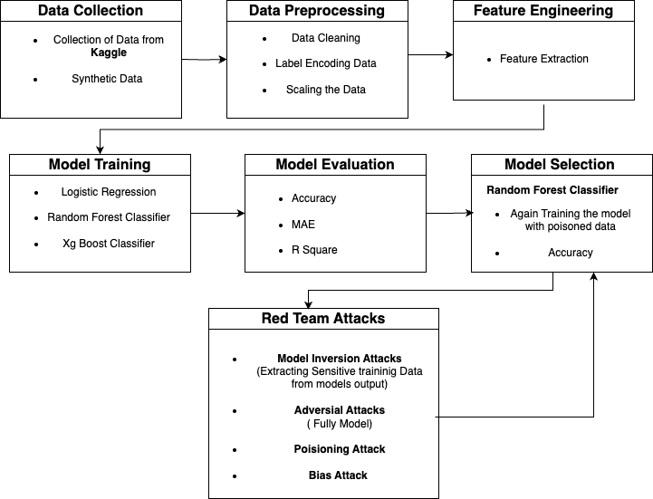

# Credit Score Prediction System — End‑to‑End ML Pipeline (BankChurners)

This repository contains an end‑to‑end workflow for **credit score / customer churn risk** modelling on the popular `BankChurners.csv` dataset. It includes **data preprocessing**, **feature engineering**, **model training & tuning**, **evaluation**, and **explainability & fairness checks**—all implemented in Jupyter notebooks.

<p align="center">
  
</p>

---

## ✨ What’s inside

- **Preprocessing pipeline** — cleaning, type fixes, encoding (Label/One‑Hot), scaling, outlier checks, optional PCA, multicollinearity (VIF), and **class imbalance handling with SMOTE**.
- **Models** — baseline **Logistic Regression** and a tuned **Random Forest Classifier** (with `GridSearchCV` / `RandomizedSearchCV`).
- **Evaluation** — accuracy, ROC‑AUC, confusion matrix, classification report.
- **Explainability** — **SHAP** summary/feature effects and **LIME** local explanations for tabular data.
- **Fairness (responsible AI)** — selection rates, **Disparate Impact Ratio**, **Statistical/Demographic Parity** using `fairlearn` and `aif360`.
- **Notebooks** —
  - `Preprocessing.ipynb`: all data prep steps.
  - `creditScorePredictionSystem_RF.ipynb`: model training, tuning, evaluation, SHAP/LIME, fairness metrics.
- **Architecture diagram** — `Architecture.png` (see above).

> **Note**: The diagram also lists “Red Team Attacks” (model inversion / adversarial / poisoning / bias). The current codebase **implements fairness/bias checks**; the actual red‑teaming attack simulations are **roadmapped** (see _Roadmap_).

---

## 🗂️ Repository structure

```
.
├── Architecture.png
├── Preprocessing.ipynb
├── creditScorePredictionSystem_RF.ipynb
└── (expected data files)
    ├── BankChurners.csv
    └── test_customer_data.csv    # optional sample for batch prediction
```

---

## 📦 Dependencies

Tested with **Python 3.9+**. Key libraries:
- `pandas`, `numpy`, `scipy`
- `scikit-learn`
- `imbalanced-learn` (SMOTE)
- `statsmodels` (VIF for multicollinearity)
- `matplotlib`, `seaborn`, `plotly` (optional for interactive)
- `shap`, `lime` (explainability)
- `fairlearn`, `aif360` (fairness metrics)
- `jupyterlab` or `notebook`

### Quick install

```bash
# 1) Create & activate a virtual environment (recommended)
python -m venv .venv
# Windows: .venv\Scripts\activate
# macOS/Linux:
source .venv/bin/activate

# 2) Upgrade pip
python -m pip install --upgrade pip

# 3) Install requirements
pip install pandas numpy scipy scikit-learn imbalanced-learn statsmodels             matplotlib seaborn plotly shap lime fairlearn aif360 jupyterlab
```

> If `aif360` has build issues on your platform, you can skip it at first and re‑install later; the rest of the pipeline will still run. On Apple Silicon, ensure recent `numpy` and `scipy` are installed before `shap`.

---

## 🚀 How to run

1. **Place data files** in the repo root (or update paths in the notebooks):
   - `BankChurners.csv` (Kaggle dataset)
   - Optionally `test_customer_data.csv` for batch inference examples.

2. **Launch Jupyter**:
   ```bash
   jupyter lab   # or: jupyter notebook
   ```

3. **Execute notebooks in order**:
   - Open **`Preprocessing.ipynb`** and run all cells:
     - Handles cleaning, encoding (`LabelEncoder`, `OneHotEncoder`), `StandardScaler`,
       outlier inspection, **VIF**, optional **PCA**, and **SMOTE** to balance classes.
   - Open **`creditScorePredictionSystem_RF.ipynb`** and run all cells:
     - Trains **Logistic Regression** and **Random Forest**.
     - Performs **hyperparameter tuning** with `GridSearchCV`/`RandomizedSearchCV`.
     - Evaluates with **accuracy**, **ROC‑AUC**, **confusion matrix**, and `classification_report`.
     - Generates **SHAP** and **LIME** explanations.
     - Computes **fairness metrics** (selection rate, disparate impact ratio, statistical/demographic parity).

### Headless/automated run (optional)

You can execute the notebooks non‑interactively and save the outputs as HTML:

```bash
pip install nbconvert
jupyter nbconvert --to html --execute Preprocessing.ipynb
jupyter nbconvert --to html --execute creditScorePredictionSystem_RF.ipynb
```

The executed HTML reports will be created alongside the notebooks.

---

## 🔬 Methods in brief

### Preprocessing
- **Encoding**: `LabelEncoder`, `OneHotEncoder`
- **Scaling**: `StandardScaler`
- **Outliers**: distribution and z‑score/IQR inspection (visuals)
- **Multicollinearity**: `variance_inflation_factor` (VIF)
- **Dimensionality reduction (optional)**: `PCA`
- **Imbalance**: `SMOTE` for minority oversampling

### Models
- **Logistic Regression** — simple, linear baseline
- **Random Forest Classifier** — robust non‑linear model
  - Tuned with `GridSearchCV` / `RandomizedSearchCV` (`n_estimators`, `max_depth`, `min_samples_split`, `min_samples_leaf`)
  - `StratifiedKFold` used for balanced CV splits

### Evaluation
- `accuracy_score`, `roc_auc_score`, `confusion_matrix`, `classification_report`

### Explainability
- **SHAP** (`shap.Explainer`) — global feature importance (summary plots) and per‑sample effects
- **LIME** (`lime.lime_tabular.LimeTabularExplainer`) — local, human‑interpretable rules

### Fairness
- **Selection rate** per sensitive group (`fairlearn.metrics.selection_rate`)
- **Disparate Impact Ratio** (favorable rate minority / majority)
- **Statistical/Demographic Parity Difference** (`fairlearn` / `aif360`)

> The notebooks illustrate fairness on **Gender** as an example (ensure the attribute is preserved before encoding or re‑mapped for analysis).

---

## 📊 Results & outputs

The notebooks print metrics and render plots inline. Typical outputs include:
- Best RF hyperparameters from grid search
- ROC‑AUC/accuracy and confusion matrix
- SHAP summary plot & dependence plots
- LIME explanation for a selected record
- Fairness diagnostics (selection rates, disparate impact, parity difference)

> Reproduce by running the cells. Exact numbers depend on pre‑processing choices and random seeds (use `random_state=42` where provided).

---

## 🛣 Roadmap

- Implement **red‑team attack simulations** mentioned in the diagram:
  - **Model inversion** (privacy leakage checks)
  - **Adversarial examples** (evasion attacks on tabular models)
  - **Data poisoning** (training‑time robustness)
- Add **model persistence** (`joblib`) and a simple **CLI/REST API** for inference.
- Add **XGBoost** and **SVC** baselines with calibrated probabilities.
- Add **unit tests** and a **Makefile** for one‑command runs.

---

## 📁 Data source

- Dataset: Kaggle’s **BankChurners** (`BankChurners.csv`). Ensure you comply with the dataset license/terms when redistributing.

---

## 🧩 Troubleshooting

- **`aif360` installation**: If you see build errors, try installing via `pip install aif360==0.6.1` (or latest), and ensure `numpy`, `scipy`, and `scikit-learn` are already installed.
- **`shap` on macOS/Apple Silicon**: Upgrade `numpy`/`numba`, and restart the kernel.
- **Plots not showing**: In Jupyter, ensure the cell with `%matplotlib inline` (if used) has run.
- **Memory errors with SHAP**: Use a subset of features/rows or `TreeExplainer` for tree models.

---

## 🔒 Disclaimer

This code is intended for research/education. Do **not** use it for production credit decisions without proper compliance, fairness audits, and security hardening.

---

## 📜 License

Specify your license (e.g., MIT).

---

## 👩‍💻 Author / Contact

Maintained by **PinakashieldTech**. Contributions and issues are welcome!

